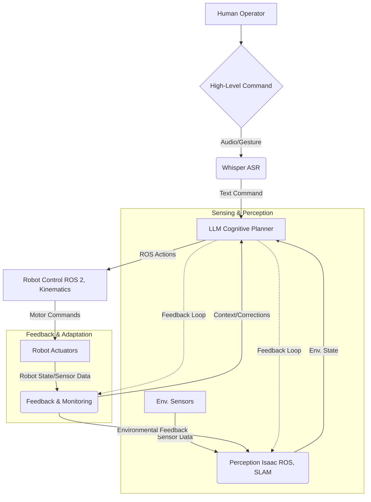

# Capstone: Autonomous Humanoid Pipeline

Throughout this book, we have explored the foundational components required to build intelligent humanoid robots. We began with the robotic nervous system provided by ROS 2, moved through the digital twin concept with Gazebo and Unity, delved into the AI-robot brain powered by NVIDIA Isaac for perception and simulation, and finally examined Vision-Language-Action (VLA) pipelines for natural interaction. This capstone chapter synthesizes these concepts, presenting a high-level overview of a complete autonomous humanoid pipeline, demonstrating how these diverse technologies coalesce to create truly intelligent physical AI.

## The Integrated Autonomous Pipeline

An autonomous humanoid robot capable of understanding and executing complex tasks in unstructured human environments requires a sophisticated integration of hardware and software. The following conceptual pipeline illustrates how the various modules discussed in previous chapters would interact:

*Figure 3: Conceptual Autonomous Humanoid Pipeline*

### 1. High-Level Human Command

The process begins with a human operator issuing a natural language command, potentially multimodal (e.g., "Go to the kitchen and grab a glass of water, please," accompanied by a pointing gesture).

-   **Technologies**: Microphones, cameras, haptic sensors.

### 2. Perception & Understanding (Whisper + Multimodal AI)

The robot's sensory inputs are processed to understand the human's intent and the current state of the environment.

-   **Speech-to-Text**: **Whisper ASR** transcribes the verbal command into text.
-   **Visual Perception**: **NVIDIA Isaac ROS** perception modules (object detection, semantic segmentation, human pose estimation) process camera and depth sensor data to identify objects, locations, and human gestures.
-   **Multimodal Fusion**: Information from speech, vision, and other sensors are fused to create a rich contextual understanding.

### 3. Cognitive Planning (LLM-based)

The textual command and environmental understanding are fed into an LLM, which acts as the robot's high-level cognitive planner.

-   **Intent Extraction**: The LLM extracts the core intent ("grab a glass of water") and identifies key entities ("glass," "water," "kitchen").
-   **Task Decomposition**: The LLM breaks down the complex task into a sequence of simpler, executable sub-goals (e.g., "Navigate to kitchen," "Locate glass," "Grasp glass," "Navigate to sink," "Fill glass," "Navigate to human," "Hand over glass").
-   **Environment Grounding**: The LLM grounds abstract concepts (like "kitchen") to specific locations or zones in the robot's internal map, using current environmental perception.
-   **Action Sequence Generation**: The LLM translates the decomposed sub-goals into a series of **ROS 2 actions** or service calls (e.g., `Nav2_goto(location='kitchen')`, `IsaacROS_object_grasp(object_id='glass')`, `ROS2_fill_container(container_id='glass')`).

### 4. Low-Level Control & Execution (ROS 2 + Kinematics)

The ROS 2 action sequence from the LLM is executed by the robot's low-level control systems.

-   **Navigation**: **Nav2** (integrated with Isaac ROS SLAM) plans a collision-free path to the kitchen.
-   **Locomotion**: Humanoid-specific gait generators and balance controllers (utilizing ZMP and Whole-Body Control) enable stable movement.
-   **Manipulation**: Inverse Kinematics (IK) solvers calculate joint trajectories for grasping the glass. Force control ensures a delicate touch.
-   **Actuator Control**: ROS 2 `motor_control_nodes` send precise commands to the robot's many motors.

### 5. Continuous Feedback & Monitoring

Throughout execution, the robot continuously monitors its environment and its own state.

-   **Sensor Feedback**: Camera, LiDAR, IMU, and proprioceptive (joint position, force) sensor data are streamed via ROS 2 topics.
-   **Perception Update**: Isaac ROS perception modules continuously update the robot's understanding of its surroundings.
-   **Progress Monitoring**: The LLM monitors the execution of sub-goals. If an action fails or the environment changes unexpectedly, the LLM can trigger replanning or request clarification from the human.

### 6. Human Interaction & Clarification

If the robot encounters an ambiguity or failure, it can engage in dialogue with the human.

-   **Text-to-Speech**: LLM-generated questions (e.g., "Which glass do you mean?") are converted to speech.
-   **Clarification Loop**: The robot receives verbal clarification via Whisper ASR, feeds it back to the LLM, and updates its plan.

## The Role of Simulation in the Capstone Pipeline

High-fidelity simulation, primarily **Isaac Sim**, is critical at every stage of this pipeline:

-   **Training AI Models**: Generating massive synthetic datasets for training perception models and LLMs for task decomposition.
-   **Testing Planning Algorithms**: Validating the LLM's planning capabilities in a diverse set of virtual environments and scenarios.
-   **Debugging Control Systems**: Testing locomotion, balance, and manipulation controllers in a safe, reproducible environment.
-   **Sim-to-Real Transfer**: Using techniques like domain randomization to ensure that policies learned in simulation generalize effectively to the physical humanoid robot.

## Conclusion

This conceptual capstone pipeline illustrates the intricate dance between high-level AI reasoning and low-level robotic control. By integrating ROS 2 as the communication backbone, NVIDIA Isaac as the AI-robot brain, and VLA pipelines for natural interaction, we can envision a future where autonomous humanoid robots seamlessly blend into our environments, understanding our commands and performing complex tasks with intelligence and grace. While the journey is long, the foundational technologies and methodologies discussed in this book provide a clear roadmap for this exciting frontier of Physical AI.
